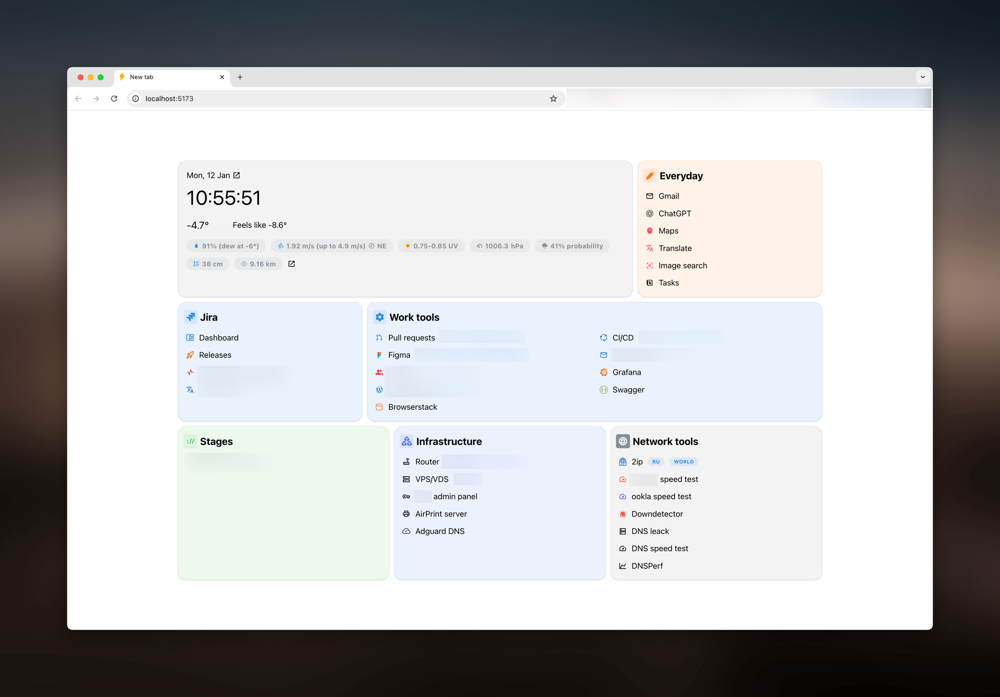

# Custom chrome new tab page

Biome + Bun + Vite + Mantine + tanstack/query

- Run `bun install # or npm install, but its better to use bun`
- Rename `src/models/example-data.ts` to `src/models/data.ts`
- Configure `src/models/data.ts` as you want
- Run `bun run --bun build`
- Open [chrome://extensions](chrome://extensions)
- Press "Load unpacked" button
- Select `dist` directory